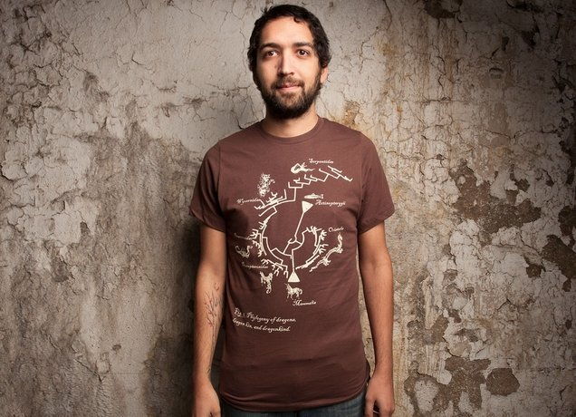

# DragonPhylogeny

This is the official repository for the Dragon Phylogeny Project: a phylogenetic exploration of dragons, dragon-kin and dragonkind, as depicted in historical works of art

# Support

This project began as a diversionary exercise at the tail end of Dr. Colautti's PhD Thesis, and it now lives as as part of a suite of undergraduate tutorial for teaching data structures and phylogeny building in R (https://colauttilab.github.io/DragonPhylogenyTutorial.html). It was rescued with the help of several enthusiastic and talented students. Thanks to their hard work, we have re-released the image on a set of customizable t-shirts for purchase: 

https://dragonphylogeny.threadless.com/

100% of profits from the t-shirt support projects and grants that will help to diversify STEM research, particularly in Ecology and Evolutionary Biology.

# Repository Content:

## Tutorial

[DragonPhylogenyTutorial.html](https://colauttilab.github.io/DragonPhylogenyTutorial.html) 

A step-by-step tutorial written for undergraduate biology students. If you are not familiar with R, you may want to try this [R Crash Course](https://colauttilab.github.io/RCrashCourse/1_fundamentals.html) first.

## Traits

[Traits.md](./Traits.md)

List of traits, with coding used in DragonMatrix.net

## Coded Trait Matrix

[DragonMatrix.nex](./DragonMatrix.nex)

Binary-coded trait matrix (NEXUS format)

## Weights

[Weights.csv](./Weights.csv)

Weightings used on trait matrix, with a brief rationale for each

## Raw Trait Matrix

[TraitMatrixRaw.csv](./TraitMatrixRaw.csv)

Trait matrix, raw data, unencoded

## Images

[Dragon_Pics.pdf](./Dragon_Pics.pdf)

**NOTE** Large file size (9.4MB)
PDF containing images of all dragons used in the original Dragon Phylogeny

# External Links

## T-shirt

[Threadless.com](https://www.threadless.com/product/4313/dragon_phylogeny)

The official, original design of the Dragon Phylogeny T-Shirt on Threadless.com

## Media Coverage

io9/Gizmodo Article

[io9.com](https://io9.gizmodo.com/5936427/the-evolutionary-history-of-dragons-illustrated-by-a-scientist)
A nice write-up about the project on the blog io9.com (now part of Gizmodo).

CBC.ca Interview

[cbc.ca](http://www.cbc.ca/news/canada/british-columbia/dragon-family-tree-springs-from-scientist-s-imagination-1.1218358)
Interview with CBC radio, later posted on their website.

Facebook Site

[facebook.com](https://www.facebook.com/DragonPhylogeny/?hc_ref=ARQG8kK8fOehVSNH9pYicy0hqj0itLJStZ27jpfeGpgpHB0sSIu27yaHA0wM9HDR7oY&fref=nf)
Facebook site created for the phylogeny and then never used again

Nature Article (Not directly related)

[nature.com](https://www.nature.com/articles/520042a?hc_location=ufi)

Dragons and climate change. Good read, but no direct link to the Dragon Phylogeny
